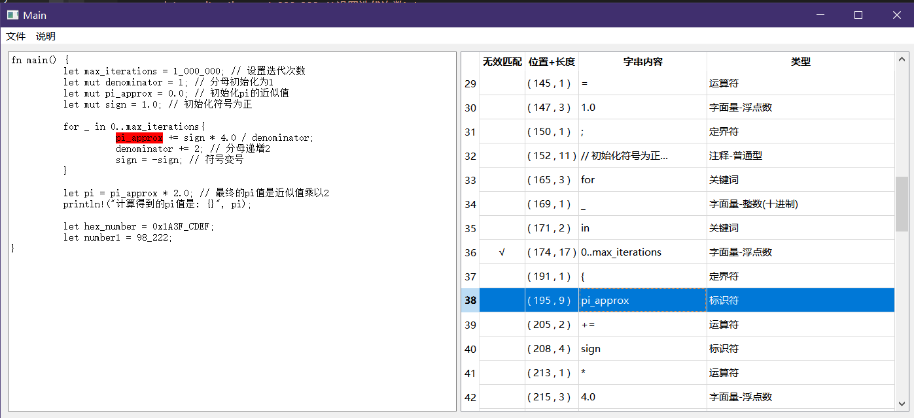

# 实验1 Rust单词拼装分类器

简单说明一下项目构成：
- ``XJ_StringTreeNode``：用于字符串的快速查找，不使用集合std::set<std::string>是为了避免出现不必要的std::string的构造析构以及字串的哈希计算，目的是提高效率。
该节点类用于构筑一个字符串树，每个树节点都有一个状态``bool isFinal``以判断是否成功匹配，并且记录其下的子节点``std::map<char, XJ_StringTreeNode*> nexts``，因此构筑好字符串树后就能拿着这个树的根节点对一段字符串进行逐字符遍历，一旦字符串遍历过程中当前节点移动失败就是匹配失败，若是字符串遍历结束后当前节点的isFinal为假也是匹配失败；
- ``XJ_CharTest``：用于字节流的字符判断，主要用于判断某字节是否为新字符的首字节以及是否为ASCII字符。需要使用派生类以对应不同字符集；
- ``XJ_LexemeAnalyse``：项目核心，词法分析器，允许分批次传入字节流，并返回Token列表；
- ``XJQ_ScanResultPreview``：用于扫描结果的UI显示，使用的是Qt框架。左侧是文本框，在内容发生变化时会发送信号textChanged以便调用词法分析器重新分析文本，右侧是分析结果列表，同时选中右侧列表中的某个项将会对应选中左侧文本框中的字串； 
- ``Main``：主项目，将以上项目联合在一起；

 

解决方案中的每个项目都能独立运行，需要注意的是部分项目存在着简单的依赖：
- ``XJ_LexemeAnalyse``：依赖``XJ_StringTreeNode``、``XJ_CharTest``；
- ``Main``：依赖``XJQ_ScanResultPreview``、``XJ_LexemeAnalyse``、``XJ_StringTreeNode``、``XJ_CharTest``；

 
 

# 运行预览：

[运行预览视频-1](./运行预览视频-1.mp4)

 

关于``0..max_iterations``被当做了无效项而没有细化出其中的``..``的原因，直白点的说就是不知道如何处理，就此搁置着。
直接扫一遍然后抓出``..``的做法当然可以啊，但这么蠢的做法我是真不喜欢，万一又跟着来个``...``又或是别的什么怪东西那我岂不是又要打一次补丁？索性不搞。

修这bug需在项目``XJ_LexemeAnalyse``中完成：在源码的``XJ_LexemeAnalyse``中搜``TODO``即可定位到此bug。

